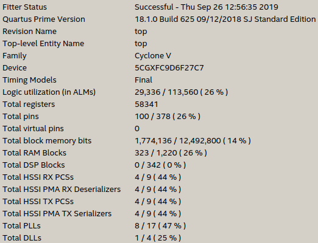
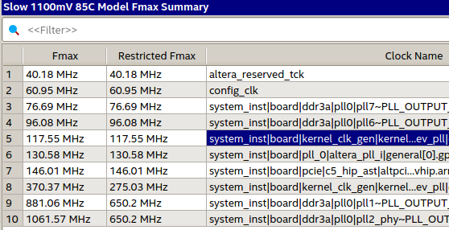
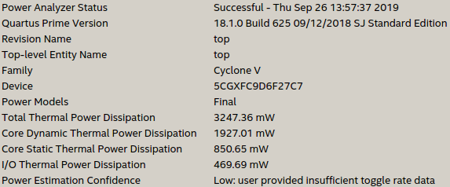

# BiSUNA - OpenCL

**Bi**nary **S**pectrum-unified **N**euroevolutionary **A**rchitecture capable of executing OpenCL
kernels. This project presents a different approach to train from scratch
Binary Neural Networks (BNN) using neuroevolution as its base technique (gradient
descent free) that takes advantage of OpenCL acceleration.

Obtain non-linear Deep NN that use binary values in weights, activations, operations
and is completely gradient free; which brings us to the brief summary of the
capabilities of shown with this implementation:

• Weights and activations are represented with fixed length bitset (16 bits)
• Only logic operations (AND, XOR, OR...) are used, no need of Arithmetic Logic Unit (ALU)
• Neuroevolution is employed to drive the space search
• BNN do not have a fixed network topology, which adapt and optimize for the problem at hand.


## Installation

This project has been tested with correct execution on Linux and MacOS. It has one library
requirement in order to be able to compile code from the makefile. Basically it needs the
OpenCL development libraries. If running in a Debian/Ubuntu distribution it is as simple
as running ```sudo apt install build-essential opencl-dev```

In order to recreate that environment, check the file "[Install-Compile-Execute.sh](scripts/Install-Compile-Execute.sh)"

If FPGA is targeted, the Altera Offline Compiler is needed to compile the aocx, which is
the bitstream used to reprogram it at time the binary executes.

## Execution

Once a binary is obtained, it is just about to executing the file along with a configuration
file that provides all runtime details like the following:

```
./bisuna resources/BiSUNAConf.ini
```

The ini file will instruct BiSUNA what type of execution, device type and all other details.
Have in consideration that BiSUNAConf.ini has a parameter "EnvironmentConf", which should
have the path to another "ini" file with the correct environment details.

## Reinfocement Learning Environments

- Mountain Car
- Double Cart Pole (with and without velocities)
- Function Approximation
- Multiplexer
- Single Cart Pole
- SymmetricEncryption

## Original SUNA
This project was based on the original [SUNA](https://github.com/zweifel/Physis-Shard) implementation.

## Resource Utilization

Below are shown three screenshots of the resource utilization when BiSUNA was compiled for the Cyclone V:





